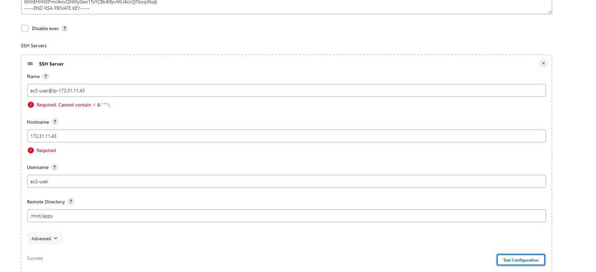

# workplace-9

This project is a continuation of the last project ([workplace-8](https://github.com/olaniyi2oguns/Workplace-8.git))

# Installation and configuration of Jenkins server

# Step 1 -Install Jenkins Server

1 *Create an AWS EC2 server based on Ubuntu Server and you can give it any name you like*.

2 *Install JDK because Jenkins is a java-based application*

`sudo apt update`

`sudo apt install default-jdk-headless`

3 *Install Jenkins*

`wget -q -O - https://pkg.jenkins.io/debian-stable/jenkins.io.key | sudo apt-key add -`

`sudo sh -c 'echo deb https://pkg.jenkins.io/debian-stable binary/ > \  /etc/apt/sources.list.d/jenkins.list'`

`sudo apt update`

`sudo apt install jenkins`

Check the status of your jenkins to ensure it is running

`sudo systemctl status jenkins`

NOTE: Should you face any challenges installing jenkins, you can [visit the official website](https://www.jenkins.io/doc/book/installing/linux/) of Jenkins as there are new releases that can impact the above configuration. you can as well run the commands below:

`curl -fsSL https://pkg.jenkins.io/debian/jenkins.io-2023.key | sudo tee \
  /usr/share/keyrings/jenkins-keyring.asc > /dev/null`

`echo deb [signed-by=/usr/share/keyrings/jenkins-keyring.asc] \
  https://pkg.jenkins.io/debian binary/ | sudo tee \
  /etc/apt/sources.list.d/jenkins.list > /dev/null`

`sudo apt install openjdk-11-jre`

`sudo apt-get update`

`sudo apt-get install jenkins`

Then, check the status

`sudo systemctl status jenkins`


4 *Open port 8080 by creating new inbound Rule in the ec2 security group.*

5 *Start jenkins set up*

From your browser, access jenkins with

```http://<jenkins-public-server-IP-Address>:8080```

This will take you to the default admin password page


Open your terminal and login to your jenkins server and run the command below to retrieve the default password to your jenkins server.

`sudo cat /var/lib/jenkins/secrets/initialAdminPassword`

copy the password and paste it into the administrator password box in the image above.

This will take you to the page in the image below where you be asked for which plugins you want to install. Select "Install suggested plugins"


Once the plugins have been installed successfully, create admin user and password as your jenkins will be ready for use.


# Step 2 Configure Jenkinsto retrieve source codes from GitHub using Webhook

Login to your github account and open the repository where your work is located. Click on settings and select "webhooks"


Then, enter `http://<jenkins-server-public-IP-address>:8080/github-webhook/` into payload url box and change the content type to JSON and then click "add webhook"


Go back to your jenkins server and click "Create" and the give any name of your choice and select Freestyle project and click ok


On the next page, under source code management, select git and paste in your repository link into the repository url box and click save


Click on "Build Now" to check if your configuration is working as expected

If the job is built successfully, click on configure to set your build triggar. Stroll down to where you locate "Build Triggars" and select "Github hook triggar for GITScm polling"


Click on add "Post-build Actions" to archieve all the files.


Go to your git repo. to make a new commit and see if this will be built in your jenkins job.

# Step 3- Configure jenkins to copy files to NFS server through ssh

You currently have your artifacts saved on jenkins server. So, there is a need for the artifact file to be sent into the /mnt/apps directory on the NFS server.

To achieve, You need to install a plugin called "publish over ssh".

Go to your jenkins server and click on "Manage Jenkins" and then click on "Manage Plugins". Click on available and search "publish over ssh" and check it. Then, click on Install without restart.

.

Go back to your dashboard and click once again "Manage Jenkins" and click on "System Configuration". Stroll down to where you find the new plugin you installed.

copy you NfS server .pem key and paste it in to the Key box. Then, Give any name to the "SSH Server Name". Enter you NFS private ip address into the "Hostname" box. Also, give the username of the NFS server and lastly, enter the NFS directory that the artifacts fill will be sent to (in this case that will be `/mnt/apps`). click on test configuration to know the correctness of your configuration.




Then, go back to the job configuration and select another post-build action by clicking on "Add post-build action" and select Send build artifacts over SSH and save


After this has been done. Go back to your terminal and open NFS server. You need to change mode of your `/mnt/apps` permission to allow the artifact file to be sent into it.

Once you have open the terminal and connect your NFS instance, Run the following commands

`sudo chmod -R 777 /mnt/apps`
`sudo chown -R nobody:nobody /mnt/apps`

Once this is done, go back to your git repo and make a new commit. Then, check your jenkins for a new build. If successful, the artifact file will be sent automatically to the `/mnt/apps` directory. 


If you are able to see the output like the one above then I greet you congratulations has you have just complete a continous integration through jenkins.

To make sure that the files in /mnt/apps have been udated – connect via SSH/Putty to your NFS server and check `README.MD file`

`cat /mnt/apps/README.md`
If you see the changes you had previously made in your GitHub – the job works as expected.


#CONGRATULATIONS